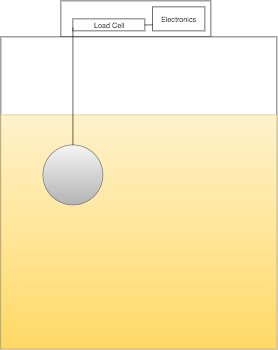

# Brew Monitor

An attempt to build a WiFi connected hydrometer & temperature monitor

## Theory

As wort ferments, the specific gravity (i.e. density relative to water) falls. Using Archimedes’ principle we can determine the SG at any given time by suspending a weight of known volume and mass in the fermenting wort.

_The following working assumes a density of 1g/cc of pure water under ideal conditions._

> A weight of volume 100cc and 150g mass is submersed in pure water. The upwards force is equal to the volume of displaced water (100g), giving the weight a net mass of 50g.
> 
> The same weight submersed in wort at 1.050 SG would displace 105g of wort giving the weight a net mass of 45g.
> 
> Measuring the change in force imparted by the weight over time will allow us to accurately monitor the fermentation process.
> 
> Corrections can be applied to account for temperature and atmospheric pressure if needed.

## Design

At its simplest, the brew monitor should consist of a weight attached to a load cell. The weight should be of a known volume and mass (we can ignore the mass and volume of the cord suspending the weight as negligible)

The weight must have a greater density than that of the wort in order to sink, so I’ll aim for 1.2g/cc (1.200) which should be more than enough for even the strongest brews.

## Prototype Bill of Materials (all from eBay)

* 6cm plastic sphere
* Stainless steel wire
* 100g Load Cell
* HX711 Load Cell ADC
* ESP-03 ESP8266 Module
* BMP180 Temperature/Pressure Sensor
* 128x64 OLED Display
* 3.3V Regulator
* Reset Switch
* Power Socket
* Circuit Board (Eagle files tbc)
* Enclosure
* PSU

## Software Plan

### Initialization:

* Check reset switch state
  * Holding reset for n seconds when applying power clears filesystem settings
* Load settings from filesystem
  * If wifi settings are present, attempt to connect to wifi
  * If not start in AP mode to allow initial configuration

### Run Mode:

* Accept http GETs to /status.json - return JSON temperature/weight/pressure/sg readings
* Accept http POSTs to /configure - write settings to filesystem
* Accept http GETs to /settings - read current config from filesystem
* Periodically send JSON status to external server if configured
* Tare - press reset switch for n seconds to update tare reading in filesystem settings

### OTA Updates:

* It should be possible to update the firmware over the internet

## Unknowns & Problem Areas

* We need to accurately measure the volume of the weight
* Do we need to calibrate the load cell?
* How can we account for CO2 bubbles adhering to the surface of the weight? Will the effect be significant?
* Does the density of wort due to temperature and pressure change in line with that of pure water?
* Ideally we’d take the temperature of the wort - will ambient temperature be good enough to get reasonable accuracy?
* How do we enclose the thing? An off the shelf project box would be best to keep price down, but we need to be careful not to expose the wort to infection - would need to be airtight. Also, if this is to replace the airlock we’d need a bubbler/blowoff tube as part of the setup.
* Is the weight food-safe?
